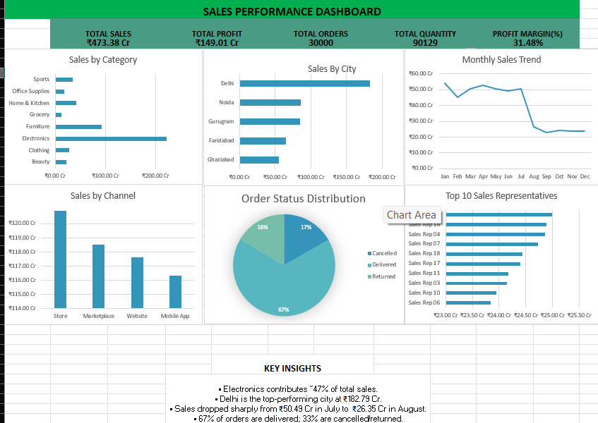

# Sales Performance Dashboard

## Overview

An Excel-based sales performance dashboard created using raw sales
data, Pivot Tables, charts, and formulas.

## Tools Used

- Microsoft Excel
- Pivot Tables
- Excel Charts
- Excel Formulas

## Analysis

The dashboard presents:

- Total Sales
- Total Profit
- Total Orders
- Total Quantity
- Profit Margin
- Sales by Category
- Sales by City
- Monthly Sales Trend
- Sales by Channel
- Order Status Distribution
- Top 10 Sales Representatives

## Dashboard Preview

## File

- `Sales_Performance_Dashboard.xlsx` — contains the source data,
  analysis, and completed dashboard.
