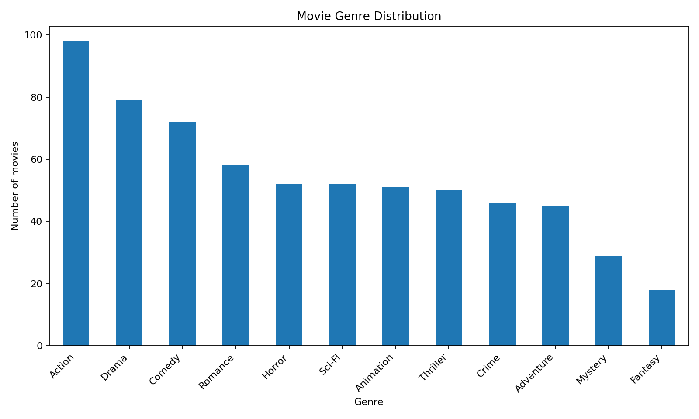
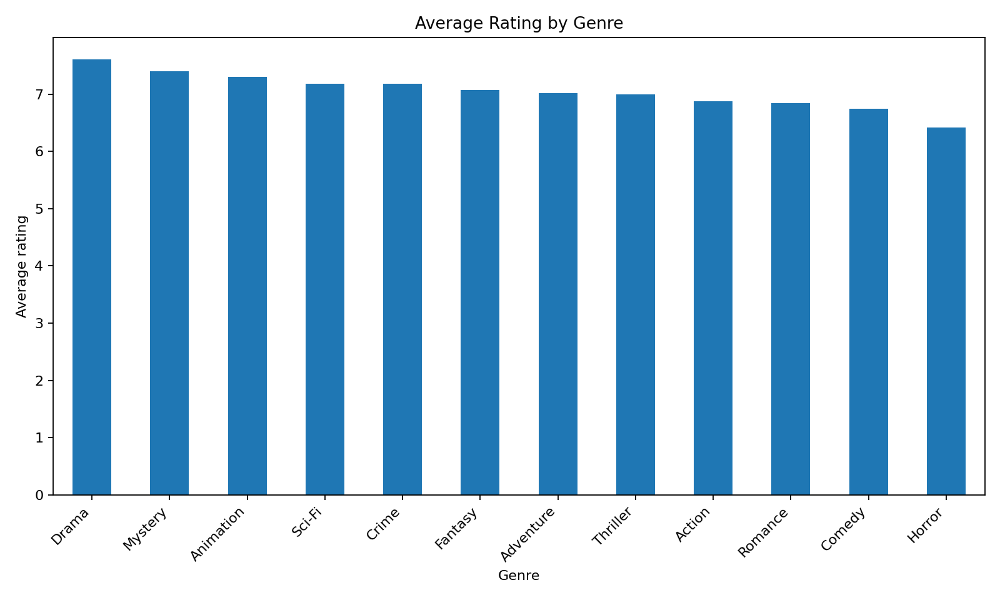
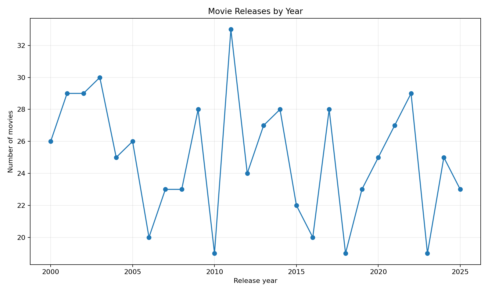
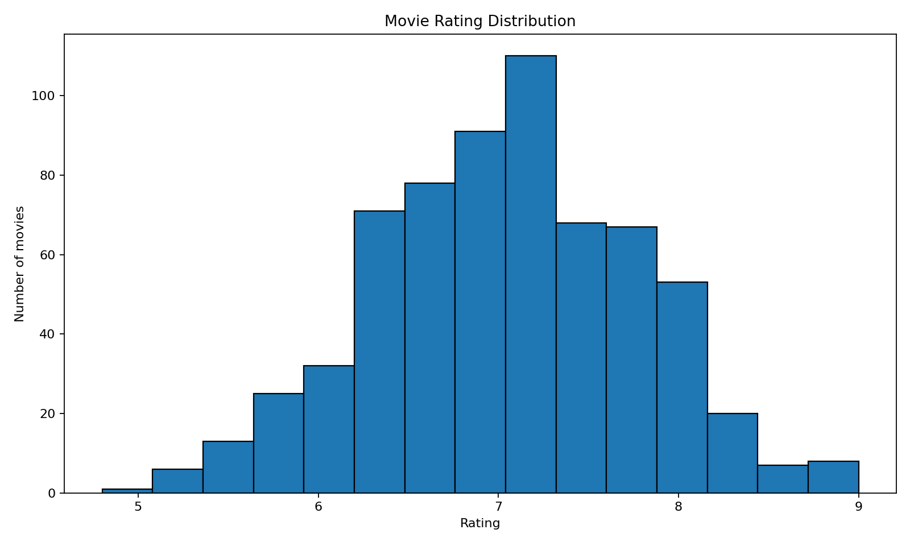
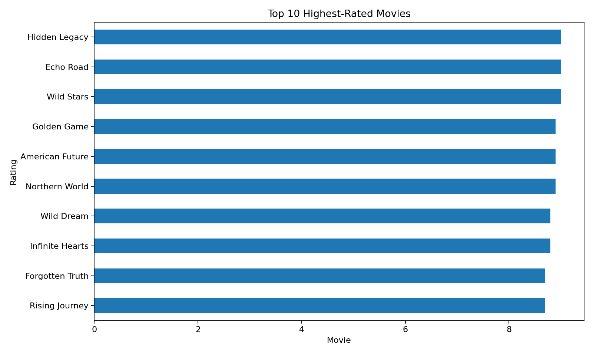
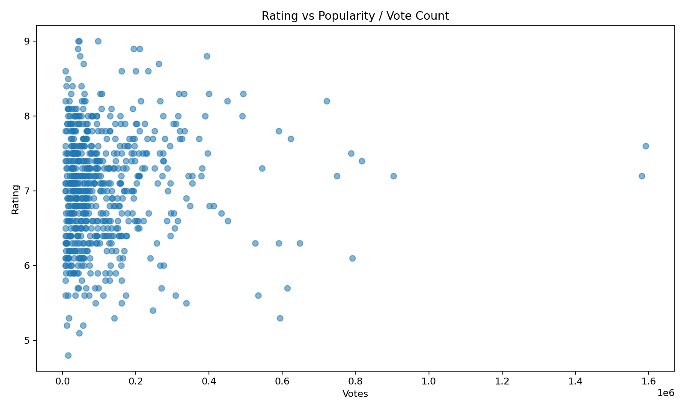

# 🎬 Movie Ratings Analysis – Python Visualization

## 📌 Project Overview

This project analyzes a movie ratings dataset containing **650 movies** using Python. The goal is to explore movie characteristics, ratings, genres, release years, and popularity through data visualization.

The analysis was performed using **Pandas, Matplotlib, and Seaborn**.

---

## 🎯 Objectives

* Analyze movie genre distribution
* Calculate average rating by genre
* Identify the year with the most movies
* Understand the distribution of movie ratings
* Identify the top-rated movies
* Analyze the relationship between ratings and vote counts
* Present insights using clear visualizations

---

## 🛠️ Tools & Technologies

* **Python**
* **Pandas** – Data cleaning and analysis
* **Matplotlib** – Data visualization
* **Seaborn** – Statistical visualization
* **Jupyter Notebook**

---

## 📊 Visualizations

### 1. Movie Genre Distribution

Shows the number of movies belonging to each genre.



### 2. Average Rating by Genre

Compares the average movie rating across different genres.



### 3. Movie Releases by Year

Shows how the number of movies varies across release years.



### 4. Rating Distribution

Shows how movie ratings are distributed across the dataset.



### 5. Top 10 Highest-Rated Movies

Displays the 10 movies with the highest ratings.



### 6. Rating vs. Vote Count

Explores the relationship between the number of votes and movie ratings.



---

## 📂 Project Structure

```text
Task-6-Movie-Ratings-Analysis/
│
├── Movie_Ratings_Analysis.ipynb
├── movie_ratings_analysis_650_movies.csv
├── Movie_Ratings_Visual_Report.pdf
├── README.md
│
└── charts/
    ├── 01_genre_distribution.png
    ├── 02_avg_rating_genre.png
    ├── 03_movies_by_year.png
    ├── 04_rating_distribution.png
    ├── 05_top_rated_movies.png
    └── 06_rating_vs_votes.png
```

---

## 🔍 Key Analysis

The project uses Python to:

1. Load the movie dataset using Pandas.
2. Inspect the dataset structure and missing values.
3. Clean and convert relevant columns.
4. Analyze genres and ratings.
5. Create multiple visualizations.
6. Extract useful observations from the charts.

---

## 📈 Dataset

The dataset contains **650 movie records** with information such as:

* Movie ID
* Title
* Genre
* Release Year
* Director
* Runtime
* Rating
* Votes
* Revenue
* Language
* Country
* Budget

---

## 💡 Conclusion

Python visualization makes it easier to identify patterns and trends in movie data. By combining Pandas with Matplotlib and Seaborn, the project transforms raw movie data into meaningful visual insights.

---

## 👨‍💻 Author

**Md Sami Ahmad**

B.Tech Computer Science & Engineering
IIMT College of Engineering, Greater Noida
